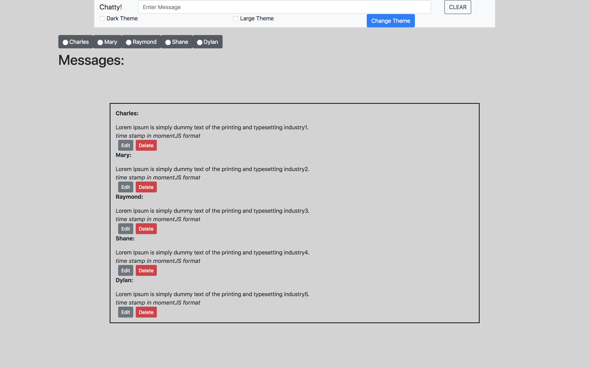

# Chatty Group Project

## Description
This project is our second collaborated project in GitHub. We created a chat application that allows the user to edit, delete, and change various themes when putting in a message in the input box located in the nav bar. The message will output to the chat box. We used radio buttons that allow you to select your user prior to creating your message. You are not able to output your message without selecting a user. This project is a compilation of various JavaScript functions. This application demonstrated our skills in: 

- Modular code
- Dependency chaining
- Asynchronous code
- DOM interaction
- Debugging

## Requirements
* Use Bootstrap
* Balanced GitHub contributions
* Completed README
* No Grunt errors
* Use ES6 Modules

## Screenshots



## Technoligies Used

- JavaScript
- HTML
- CSS
- JSON
- Bootstrap 4

## How to run this project

* Use npm to intall http-server in your terminal:

```sh

npm install -g http-server

```

* Run the server

```sh

hs -p 9999

```

* Open chrome and navigate to:

```

localhost:9999


